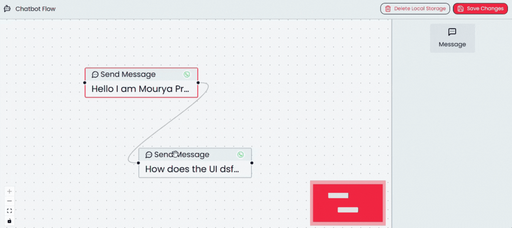

# chatbot-flow-builder



<div align="center">
  <span style="font-size: 1.5rem;">🛠️ Frontend Built With</span>
  <div align="center" style="margin-top: 8px;">
    &nbsp;
    &nbsp;
    &nbsp;
        &nbsp;
    &nbsp;
    &nbsp;
    &nbsp;
    
  </div>
</div>

> **Hi! Thanks for checking out this project! 👋**  
> This is a React-based chatbot flow builder created for the BiteSpeed Frontend Task. I appreciate you taking the time to explore the code and functionality. Your feedback and suggestions are always welcome!

## 🌟 Live Demo

🚀 **[View Live Demo](https://chatbot-flow-builder-9eo.pages.dev/)**

## 📖 Overview

This project is a template of a visual chatbot flow builder that allows users to create conversational flows by connecting message nodes. Built with React and React Flow, it provides an intuitive drag-and-drop interface for designing flows.

## ✨ Features
This Project follows all standard practices that we developers are expected to follow. I have made an extensible architecture to simplify future additions.

### Key Highlights
* **Custom Node System:** Built using a strongly typed union to support adding new node types (e.g., Message, Trigger) with minimal code changes.
* **State Management:** Used Zustand for global state management storing data on nodes, edges, and a lot of handy functions.
* **Validations:** On save, the flow is checked to ensure no  node is left alone without a target (if number of nodes itself is greater than 1).
* **Settings Panel:** Dynamically switches based on node selection; supports real-time editing of node data.
* **Flow Persistence:** Flow state is saved in **localStorage**, making it persistent across page refreshes (optional but included for demo).
* **Drag-and-Drop:** Node Panel allows intuitive addition of new nodes to the canvas.

## 🎮 How to Use

1. **Add Nodes**: Drag the "Message" node from the Nodes Panel to the canvas
2. **Connect Nodes**: Click and drag from a source handle (right side) to a target handle (left side)
3. **Edit Messages**: Click on any node to select it and edit its message in the Settings Panel
4. **Save Flow**: Click the "Save Changes" button to validate and save your flow

### 🚨 Flow Validation Rules
- Each source handle can only have **one outgoing connection**
- Target handles can have **multiple incoming connections**
- For flows with multiple nodes, only **one node** can have an empty target handle (starting node)

---

## Prerequisites
Make sure you have the following setup:
- [Git](https://git-scm.com/downloads)
- [Node.js](https://nodejs.org/en/download)
- [npm](https://docs.npmjs.com/downloading-and-installing-node-js-and-npm)

## 🚀 Installation

#### Clone the repository and navigate into the project directory
```bash
git clone https://github.com/moonbuild/chatbot-flow-builder.git
cd chatbot-flow-builder
```

#### Install dependencies
```bash
npm install
```

#### Start the development server
```bash
npm run dev
````
Once its running, go to:
👉 http://localhost:5173/

---
## 🏗️ Project Structure

```
└── src/
     ├── App.tsx                              # Main app component
     ├── AppContent.tsx                       # App content wrapper
     ├── components/
     │    └── xyflow/
     │         ├── Canvas.tsx                 # Main flow canvas
     │         ├── CustomNode.tsx             # Custom Node implementation (scalable)
     │         └── sidebar/
     │              ├── MessageConfig.tsx     # Settings panel
     │              └── NodeItems.tsx         # Nodes Selection panel
     ├── main.tsx                             # Entry point
     ├── stores/
     │    └── flowStore.tsx                   # Zustand State management
     ├── types/
     │    └── nodes/
     │         └── nodes-metadata.ts          # Type definitions for node
     └── utils/
          └── sampleFlowData.ts               # Sample data for testing
```

**Thank you once again for your time and consideration! 🚀**